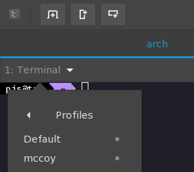
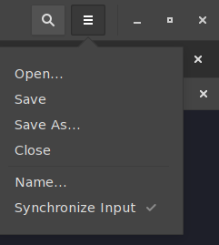

**Last update: March 17 2018**

This guide does not claim to be complete.
It reflects my view on how to setup a working Arch Linux system tailored towards data science, R and spatial analysis.
If you have suggestions for modifications, please open an issue :duck:.
Enjoy Linux! :kissing_smiling_eyes:

### Antergos/Arch Linux setup guide tailored towards data science, R and spatial analysis

<p align="center">

</p>


# Table of Contents

<!--ts-->
   * [1. Installation](#1-installation)
      * [1.1 Install options](#11-install-options)
      * [1.2 Setting up the partitions](#12-setting-up-the-partitions)
   * [2. Installing the package manager](#2-installing-the-package-manager)
      * [2.1 (Optional) Install and configure zsh](#21-optional-install-and-configure-zsh)
      * [2.2 Enabling parallel compiling](#22-enabling-parallel-compiling)
   * [3. System related](#3-system-related)
      * [3.1 Installing system libraries](#31-installing-system-libraries)
      * [3.2 Apps](#32-apps)
      * [3.3 Editors](#33-editors)
         * [3.3.1 Sublime Text 3](#331-sublime-text-3)
         * [3.3.2 Atom](#332-atom)
      * [3.4 Office](#34-office)
   * [4. R](#4-r)
      * [4.1 General](#41-general)
      * [4.2 R &amp; RStudio](#42-r--rstudio)
      * [4.3 Packages](#43-packages)
         * [4.3.1 Task view "Spatial"](#431-task-view-spatial)
         * [4.3.2 Task view "Machine Learning"](#432-task-view-machine-learning)
   * [5. Accessing remote servers](#5-accessing-remote-servers)
      * [5.1 File access (file manager)](#51-file-access-file-manager)
      * [5.2 Command-line access (Terminal)](#52-command-line-access-terminal)
   * [6. Desktop related](#6-desktop-related)
      * [KDE](#kde)
   * [7. Laptop battery life optimization](#7-laptop-battery-life-optimization)
   * [8. Additional stuff](#8-additional-stuff)
      * [8.1 arara](#81-arara)
      * [8.2 latexindent.pl: Required perl modules](#82-latexindentpl-required-perl-modules)
      * [8.3 Editor schemes](#83-editor-schemes)
      * [8.4 Fonts](#84-fonts)
      * [8.5 Icon themes](#85-icon-themes)

<!-- Added by: pjs, at: 2018-03-17T20:09+01:00 -->

<!--te-->

I recommend using [Antergos](https://antergos.com).
Officially its a distribution but most people refer to it as a graphical installer for Arch Linux.
It comes with the choice of 6 different desktop environments.
Choose a desktop that suites you.
The desktop environment is responsible for the look, feel and standard applications of your installation.
See [this comparison](https://fossbytes.com/best-linux-desktop-environments/) for some inspiration.

But don't worry: You can seamlessly switch between the desktop at the login screen of Antergos.
This way you can try out all options and choose the one that suites you most (my favorite is KDE).
What makes Antergos a distribution rather than an "installer only" is the fact that it also comes with its own libraries maintained by the Antergos developers.

First, create a installer by following [this guide](https://antergos.com/wiki/uncategorized/create-a-working-live-usb/).
If you want to set up a dual boot, [guide](https://antergos.com/wiki/de/install/how-to-dual-boot-antergos-windows-uefi-expanded-by-linuxhat) is a good resource.

Make sure to check out [the ArchWiki FAQs](https://wiki.archlinux.org/index.php/Frequently_asked_questions) and [Arch compared to other distributions - ArchWiki](https://wiki.archlinux.org/index.php/Arch_compared_to_other_distributions) to get a better understanding of Arch.

# 1. Installation

## 1.1 Install options

During installation you have several options to choose from.

Some are up to personal liking (e.g. Browser choice), others are important for a solid system:

- [x] SSH
- [x] NVIDIA drivers (if you have a NVIDIA graphics card)
- [x] AUR support
- [x] CUPS (printer support)
- [x] Bluetooth support

Whether you want to use the LTS Linux kernel or the most recent one is up to you.
I never faced any problems with the most recent one but the LTS one is theoretically the safer option.

## 1.2 Setting up the partitions

Several valid concepts exists on how to partition a Linux system.
The following reflects my current view:

1. Select "Manual" partitioning when being prompted
2. Create a SWAP partition that is >= your amount of RAM (e.g. for 16 GB RAM use 16.5 GB partition size). Format: `Linux Swap`
3. Create a 1 GB partition. Mount point: `/boot`. Format: `ext4`
4. Create a 50 GB partition for "root". Mount point: `/`. Format: `ext4`
5. With the remaining space create "home". Mount point: `/home`. Format: `ext4`

# 2. Installing the package manager

I prefer `trizen`.
Here is a list ([AUR helpers - ArchWiki](https://wiki.archlinux.org/index.php/AUR_helpers)) comparing more alternatives (scroll to the bottom).

Install `trizen`:

```bash
git clone https://aur.archlinux.org/trizen-git.git
cd trizen-git
makepkg -si
```

(We need the git version as it includes a fix for the wrapper functions below that is not yet included in the latest release when writing this guide.)

In `~/.config/trizen/trizen.conf` set "noedit" to "1" to not being prompted to edit source code on every install.

(Optional) Install [cyclon](https://github.com/gavinlyonsrepo/cylon) -> Wrapper around `trizen` and other tasks (system maintenance, etc.) .

## 2.1 (Optional) Install and configure `zsh`

The `zsh` (Z-shell) is an alternative to the default installed `bash`(Bourne-again Shell).
It has several advantages (file globbing, visual appearance, etc.).
You can of course also stick with `bash`.
However, then you need to adapt the following script to make it work with `bash` if you want to use all the defined helper functions.

To set it up, do the following (see [GitHub - sorin-ionescu/prezto: The configuration framework for Zsh](https://github.com/sorin-ionescu/prezto).
First, install the "Z-shell": `trizen zsh` and use it: `zsh`.

```bash
git clone --recursive https://github.com/sorin-ionescu/prezto.git "${ZDOTDIR:-$HOME}/.zprezto"

setopt EXTENDED_GLOB
for rcfile in "${ZDOTDIR:-$HOME}"/.zprezto/runcoms/^README.md(.N); do
  ln -s "$rcfile" "${ZDOTDIR:-$HOME}/.${rcfile:t}"
done

chsh -s /bin/zsh
```

Logout/login.

(I prefer using the `agnoster` theme.
Simply set `theme: agnoster` in line 116 of `~/.zpreztorc`.)

Afterwards set up some custom wrapper functions (`aliases`) around `trizen` to simplify usage:

In `~/.zshrc`, append the following line:

```
source "${ZDOTDIR:-$HOME}/.zprezto/pac.zsh"
```

Next, create the following script `.zprezto/pac.zsh`.
KDE: `kate .zprezto/pac.zsh`
GNOME: `sudo gedit .zprezto/pac.zsh`

(Using `kate` (KDE) or `gedit` (GNOME) you can also solve all following "file opening/creation" tasks.)

```zsh
pac () {
  case $* in
    install* ) shift 1; cd ~ && trizen -S "$@" --movepkg-dir=pkgs;;
    get* ) shift 1; cd ~ && trizen -G --aur "$@" ;;
    remove* ) shift 1; cd ~ && trizen -R --aur "$@" ;;
    search* ) shift 1; cd ~ && trizen -s "$@" --movepkg-dir=pkgs;;
    update-git* ) shift 1; cd ~ && trizen -Syu --devel --show-ood --movepkg-dir=pkgs;;
    update* ) shift 1; cd ~ && trizen -Syu --needed --show-ood --movepkg-dir=pkgs;;
    * ) echo "Invalid choice, see ~/.zpreto/pac.zsh for available commands." ;;
  esac
}
```

Open a new terminal window and the function `pac` should be available now.
You can now call `pac` with all arguments listed above (`install`, `search`, etc.).
Check [GitHub - trizen/trizen: Lightweight AUR Package Manager](https://github.com/trizen/trizen#usage) for an explanation of the created aliases.

* `pac install <pkg>`: Install the specified package (if it exists) and move it into `~/pkgs`.
* `pac search <pkg>`: Executes a search with the specified `<pkg>` returning all matches. You can then type a number of the package you want to install. Package will be moved to `~/pkgs`.
* `pac update`: Update all installed packages (from both Arch repos and AUR). Shows packages which are marked as "out-of-date" by the community.
* `pac update-git`: Updates all packages installed from `git`.
Note: These are usually build from source and certain packages may take some time to install. Don't do that daily.

**Note:** Git packages will never update automatically as they are just a snapshot build of the (at the time of installation) most recent state of the respective repository.
So think twice if you need a git package as it is in your responsibility to update it.
I usually have `rstudio-desktop-git` installed to have the latest features of RStudio as the release cycles for the stable version are quite long.

One important argument of the wrapper functions that should be explained in more detail is `--movepkg-dir`.
It will move all built packages (`<package.tar.xz>`) into `~/pkgs`.
This has the advantage that you do not need to rebuild a package that took a long time to install if you want to re-install it - just do a `pacman -U ~/pkgs/<package.tar.xz>`.
See [section 3.2](https://github.com/pat-s/antergos_setup_guide#32-apps) for a handy use case.

## 2.2 Enabling parallel compiling

Compiling packages from source can take some time.
To speed up the process by enabling parallel compiling, set the `MAKEVARS` variable in `/etc/makepkg.conf`:

`MAKEFLAGS="-j$(nproc)"`

This will use all available cores on your machine for compiling.

# 3. System related

## 3.1 Installing system libraries

For the following install calls, you can either use `trizen` or (if you added the `zsh` wrapper functions above) `pac`.
While calling `trizen <package>` will first do a search in AUR and then install the package, the complementary function for this would be `pac search <package>`. Calling `pac install` will directly install the given package.

**Never install python libraries via `pip`! All AUR packages try to install required python packages from AUR and if these have been installed via `pip` you will face conflicts.**

Always install them via your package manager, e.g. for `numpy`: `pac install python-numpy`

Python Modules for QGIS: QGIS needs some external python libraries to not throw errors on startup:

```
pac install python-gdal python-gdal python-yaml python-yaml python-jinja python-psycopg2 python-owslib python-numpy python-pygments
```

Other important system libraries:

* `pac install gdal`
* `pac install udunits`
* `pac install postgis`
* `pac install jdk8-openjdk openjdk8-src`(jdk9 still has problems with some R packages)
* `pac install texlive-most` (this is a wrapper installation that installs the most important tex libraries. Similar to `texlive-full` on other Linux distributions.)
* `pac install pandoc-bin pandoc-citeproc-bin` (for all kind of Rmarkdown stuff. Make sure to install this library as the one in the community repository comes with 1 GB Haskell dependencies!)
* `pac install hugo` (if you are a blogger using the R package `blogdown`)

## 3.2 Apps

Opinionated applications :smile:

Messaging: `pac install franz`
Mail: `pac install mailspring`
Notes: `pac install boostnote`
Reference Manager: `pac install Jabref`
Google Drive: `pac install insync`
Dropbox: `pac install dropbox-nautilus`
GIS: `pac install qgis` (careful, takes 30 min - 1h to compile)

**Tip:** You can install both `QGIS2` and `QGIS3` and switch between them.
To do so you need to build both once with `--movepkg` option from `trizen`.
Luckily, we defined this option within the [aliases](https://github.com/pat-s/antergos_setup_guide#21-optional-set-up-and-configure-zsh) for `trizen`.
Afterwards, you can switch between them using `pacman -U <package_source>`.
E.g. to install `QGIS2` after you installed `QGIS3` :

```
pacman -U ~/pkgs/qgis-ltr-2.18.17-1-x86_64.pkg.tar
```

SAGA: `pac install saga-gis`
Skype: `pac install skypeforlinux-preview-bin`
Screenshot tool: `pac install shutter`
Image viewer: `pac install xnviewmp`
Virtualbox: [VirtualBox – wiki.archlinux.de](https://wiki.archlinux.de/title/VirtualBox)
Terminal: `pac install tilix`
Browser: `pac install vivaldi-snapshot`
Dock: `pac install latte-dock` ([KDE only] If you prefer a dock layout over the default layout)
Twitter client: `pac install corebird`

## 3.3 Editors

**Note:** This section may change over time as I categorize myself as a beginner in the wide world of editors.

Editors are an important topic so I devote an extra section to them.
You can use editors to only edit text files but they can also be used as an IDE for coding.
There are many editors out there, all loved by a certain amount of people.

Here's a list of the most common ones (this list does not claim to be complete):

* Vim
* Emacs
* Sublime Text
* Atom
* Kate (KDE default)
* Nano
* etc.

Some are more tailored towards programmers and command-line action, some are more tailored towards a nice GUI experience.

### 3.3.1 Sublime Text 3

Recently I started to use [Sublime Text 3](www.sublimetext.com) as my system editor.
This means all files that are not bound to a different application are opened by SublimeText3.
Although SublimeText is not free anymore since v3, you can find free license keys on the web.
I like it because its very fast, has nice extensions (packages that are well maintained) and comes with a killer feature (for all server admins): Opening of remote files via [rsub/rmate](https://github.com/henrikpersson/rsub).
You can find my user settings [here](https://gist.github.com/pat-s/b6026fa370193b8ce260b0115903e022).
A downside is that is is not capable of displaying HTML or PDF files and does not come with an auto-compile feature if you are editing markdown files.

### 3.3.2 Atom

Thats why I use [Atom](https://atom.io) for all text editing + compiling.
It is completely free and also relies heavily on user packages.
However, finding properly maintained packages is a bit tedious.
Once configured correctly, it does a great job for all kind of writing (LaTeX, Markdown) as it has some neat packages for auto-reload of HTML and PDF files.
I usually have two panes open: On the left I edit my document and on the right I have the live preview.
You can check [my settings](https://gist.github.com/pat-s/7cb029b98f66f0783f90b5744ad2bcce) and [discover some packages](https://www.shopify.com/partners/blog/best-atom-packages-2017) that you may find useful.

## 3.4 Office

`pac install libreoffice-fresh`

If you are on a KDE Desktop, Libreoffice may flicker black/white.
This is caused by OpenGl.

To solve it, set the `value` item in following two lines of `~/.config/libreoffice/4/user/registrymodifications.xcu` to `false`:

```html
<item oor:path="/org.openoffice.Office.Common/VCL"><prop oor:name="ForceOpenGL" oor:op="fuse"><value>false</value></prop></item>
<item oor:path="/org.openoffice.Office.Common/VCL"><prop oor:name="UseOpenGL" oor:op="fuse"><value>false</value></prop></item>
```

Additionally, I recommend to install the "Papirus Icon theme" for Libreoffice: `pac install papirus-libreoffice-theme`.

# 4. R

## 4.1 General

For fast package (re-)installation using `ccache`, put the following into `~/.R/Makevars`:

```r
CXXFLAGS=-O3 -mtune=native -march=native -Wno-unused-variable -Wno-unused-function

CXXFLAGS=-O3 -mtune=native -march=native -Wno-unused-variable -Wno-unused-function -DBOOST_PHOENIX_NO_VARIADIC_EXPRESSION

# Eddelbuettel blog
VER=
CCACHE=ccache
CC=$(CCACHE) gcc$(VER)
CXX=$(CCACHE) g++$(VER)
C11=$(CCACHE) g++$(VER)
C14=$(CCACHE) g++$(VER)
FC=$(CCACHE) gfortran$(VER)
F77=$(CCACHE) gfortran$(VER)
```

Additionally, install `ccache` on your system: `pac install ccache`.
See [this blog post](http://dirk.eddelbuettel.com/blog/2017/11/27/#011_faster_package_installation_one) by Dirk Eddelbuettel as a reference.

Next, install the "Intel MKL" or "openblas" library to be used in favor of "libRlapack/libRblas" in R.

These libraries are responsible for numerical computations.
The "Intel MKL" library has [impressive speedups](http://pacha.hk/2017-12-02_why_is_r_slow.html) compared to the default ones "libRlapack/libRblas".
Thanks @marcosci for the hint :yellowheart:

**Note:** The download size of `intel-mkl` is around 4 GB and takes a lot of memory during installation.
Most of it will stored in the swap (around 10 GB) so make sure your SWAP space is > 10 GB.

If you cannot install `intel-mkl`, try `libopenblas`: `pac install openblas-lapack`.
It does not require a full re-installation of R from source and simply auto-detects the `openblas` library.

Also to successfully install `intel-mkl`, you need to temporarly increase the `/tmp` directory as `intel-mkl` needs quite some space: `sudo mount -o remount,size=20G,noatime /tmp`.

Fortunately, there is an AUR package that wraps the R installation with the `intel-mkl` installation:

```
pac install r-mkl
```

**Note:** Currently you need to edit the `r-mkl` PKGBUILD during installation and comment some lines.
So do `pac install --noedit=0 r-mkl` and then:

```
# check() {
#   cd R-${pkgver}
#   make check-recommended
# }
```

## 4.2 R & RStudio

Install R: `pac install r`.

Use `pac search rstudio` and pick your favorite release channel.
During installation R will get installed as a dependency (if you have not already done so).

## 4.3 Packages

Open RStudio and install the R package `usethis` (it will install quite a few dependencies, get a coffee :D) and then call `usethis::browse_github_pat()`.
Follow the instructions to set up a valid `GITHUB_PAT` environment variable that will be used for installing packages from Github.

### 4.3.1 Task view "Spatial"

Of course you it is not required to install all packages of a task view.
You will never use all packages of a task view.
In my opinion, however, it is pretty neat to have one command that install (almost) all packages I use of a certain field.
I do not care about the additional packages installed.

Required system libraries:

* jq (`pac install jq`)
* fortran (`pac install gcc-fortran`)
* v8-3.14 (`pac install v8-3.14`)
* tk (`pac install tk`)
* nlopt (`pac install nlopt`)
* gsl (`pac install gsl`)

Some R packages (`geojsonlite`, etc.) require the `V8` [package](https://github.com/jeroen/V8) which depends on the outdated `v8-314` library.

For `rJava` we need to do `sudo R CMD javareconf`.

Now you can install the `ctv` package and then do `ctv::install.views("Spatial").
This will install all packages listed in the [spatial](https://cran.r-project.org/web/views/Spatial.html) task view.

Packages that error during installation (Please report back if you have a working solution):

* ProbitSpatial
* spaMM
* RPyGeo (Windows only)

### 4.3.2 Task view "Machine Learning"

Required system libraries:

* `pac install nlopt`

Packages that error during installation (Please report back if you have a working solution):

* interval (requires Icens from Bioconductor)
* LTRCtrees (requires Icens from Bioconductor)

# 5. Accessing remote servers

## 5.1 File access (file manager)

There are multiple ways to do so ([Auto-mount network shares (cifs, sshfs, nfs) on-demand using autofs | Patrick Schratz](https://pat-s.github.io/post/autofs/), [fstab - ArchWiki](https://wiki.archlinux.org/index.php/fstab)).

Here  is an example of a `fstab` setup for a `sshfs` (to Linux server) and `cifs` (to Windows server) mount.
Append those lines to `/etc/fstab`; don't overwrite the existing content as this will result in boot errors otherwise!

```
# sshfs
sshfs#<username>@<ip>:<remote mount point> <local mount point> fuse        reconnect,idmap=user,transform_symlinks,identityFile=~/.ssh/id_rsa,allow_other,cache=yes,kernel_cache,compression=no,default_permissions,uid=1000,gid=100,umask=0,_netdev,x-systemd.after=network-online.target   0 0

# cifs
//<ip>/<remote mount point> <local mount point> cifs        credentials=/etc/.smbcredentials.txt,uid=1000,file_mode=0775,dir_mode=0775,gid=100,sec=ntlm,vers=1.0,dom=ads.uni-jena.de,forcegid,_netdev,x-systemd.after=network-online.target 0 0
```

**Notes:**

* (cifs) Depending how new the Windows server is, you do not need `vers=1.0`.
* (cifs) Store your login credentials for the windows server in a file, e.g. `/etc/.smbcredentials.txt` with contents being `username = <username>` and `password = <password>`.
* (sshfs) Copy `.ssh/id_rsa` to `root/.ssh/` as the mount will be executed by the root user.
* (cifs) Install the Arch Linux kernel headers for the `cifs` package to work (and later on for Virtualbox): `pac install linux-headers`

Reboot.

## 5.2 Command-line access (Terminal)

You can easily connect to all servers you have access to with a little one-time effort.

Terminal applications are capable of storing "Profiles" that save the configuration to connect to a specific server.

1. Create a profile for each server
2. Under `<profile name> -> Command -> [x] Run a custom command instead of my shell` put your `ssh` command in, e.g. `ssh <username>@<servername>`.
3. Open all profiles in tabs: Select the desired profile and click "New session" (the left one of the three buttons at the top).



4. Save each open profile with `save as` in a folder of your liking.



5. Create a wrapper script that loads exactly this configuration:

```bash
#!/bin/bash

TILIX_SESSIONS_FOLDER=<path to folder with all saved configuration files>

TILIX_OPTS=""

for session in $TILIX_SESSIONS_FOLDER/*; do
  TILIX_OPTS="$TILIX_OPTS -s $session"
done

tilix $TILIX_OPTS
```

For convenience, set the execution of this script to an alias in `~/.zpreztorc`:

```
alias servers='bash ~/tilix_all.sh'
```

Now all you need to do is typing `servers` to load a terminal configuration with all your server connections.

# 6. Desktop related

## KDE

If you want to use an automatic login to a VPN and the networkmanager-daemon (e.g. Openconnect) does not store your password, try the `network-manager-applet` package.
It is the GNOME network-manager and has for some reason no problems with storing the password.

# 7. Laptop battery life optimization

Although the Linux kernel has a lot of power saving options, they are not all enabled by default.

There are two main power optimization tools:

* Powertop
* TLP

I prefer `tlp` as `powertop`often causes trouble with USB devices going into sleep mode.
Also, applying the changes on boot is easier with `tlp`.

`pac install tlp`

Then follow the instructions on [TLP - ArchWiki](https://wiki.archlinux.org/index.php/TLP) to configure it correctly.

`powertop`though is useful to check the applied settings. Do `sudo powertop` and go to the "tunables" section and check if most settings are "GOOD" (most are "BAD" before applying `tlp`).


# 8. Additional stuff

## 8.1 arara

[GitHub - cereda/arara: arara is a TeX automation tool based on rules and directives.](https://github.com/cereda/arara)
An automatization tool for TeX: `pac install arara-git`

## 8.2 latexindent.pl: Required perl modules

`latexindent` is a library which automatically indents your LaTeX document during compilation: [GitHub - cmhughes/latexindent.pl](https://github.com/cmhughes/latexindent.pl)

`pac install perl-log-dispatch perl-dbix-log4perl perl-file-homedir perl-unicode-linebreak`

## 8.3 Editor schemes

I use the [Dracula](https://draculatheme.com) scheme in almost all applications.
While its comes integrated into RStudio, here are installation instructions for [Kate](https://draculatheme.com/kate/) and [Tilix](https://github.com/krzysztofzuraw/dracula-tilix).

## 8.4 Fonts

I enjoy using [Fira Code](https://github.com/tonsky/FiraCode).
I use it as a coding font in all editors (monospace ftw) but also as a system wide font (the "medium" variant) with size 10.

`pac search fira-code`

## 8.5 Icon themes

There are two awesome icon themes: [Papirus](https://github.com/PapirusDevelopmentTeam/papirus-icon-theme) and [numix](http://numixproject.org).

Try them and choose for yourself.
You will see what a tremendous impact good icons can have on your daily work.
